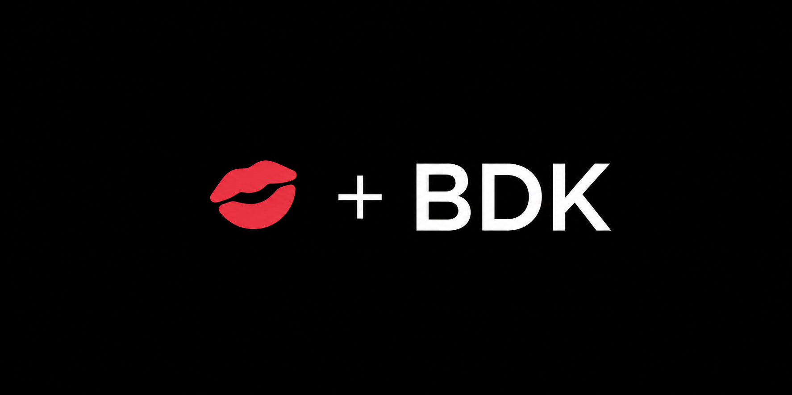

<p align="center">
  
</p>

# KISS-BDK

**Air-gapped Bitcoin transactions powered by BDK and signed by KISS.**

KISS-BDK is an experimental Rust coordinator for Bitcoin Testnet4. Bitcoin Dev
Kit manages the online, watch-only wallet while KISS, an air-gapped hardware
signer written in C, keeps the private keys offline and approves signatures.

## Live flow

`Pair` → `Sync` → `Build` → `Sign` → `Verify` → `Broadcast`

- **BDK** manages the descriptor, addresses, wallet state, coin selection,
  fees, change, PSBT creation, finalization, and broadcasting.
- **KISS** verifies the transaction offline, signs it, and returns the signed
  PSBT as animated BC-UR QR.

```text
Testnet4 / Esplora ↔ Rust + BDK ↔ PSBT over QR ↔ KISS C signer
```

## What BDK does

The coordinator uses:

- `bdk_wallet` for the watch-only descriptor wallet, receive/change derivation,
  SQLite persistence, balances, UTXOs, transaction building, and PSBT
  finalization.
- `bdk_esplora` for Testnet4 scanning and transaction broadcasting over HTTPS.

BDK is the wallet engine, not the network server and not the signer.

## Build

Requirements: Rust, a C compiler, and a webcam. The current hardware flow is tested on macOS.

```sh
cargo test --locked
cargo build --release --locked
```

The executable is `target/release/kiss-bdk`.

## QR-only demo

Create a fresh runtime directory:

```sh
mkdir -p hackathon-demo
cd hackathon-demo
```

On KISS, enable Testnet, unlock the wallet, then open **PAIR COORDINATOR → DESKTOP**.

```sh
../target/release/kiss-bdk init --scan-qr
../target/release/kiss-bdk sync
../target/release/kiss-bdk address
```

Compare the address on KISS, fund it with Testnet4 coins, and sync again. A pending faucet payment is sufficient for the demo.

```sh
../target/release/kiss-bdk sync
../target/release/kiss-bdk address
```

Copy the new address as the self-send destination:

```sh
KISS_DEST='tb1q...'
../target/release/kiss-bdk create \
  --to "$KISS_DEST" --sats 10000 --fee-rate 2 --qr
```

On KISS choose **SIGN → SCAN QR**, review the transaction, and sign. While KISS displays the animated signed QR:

```sh
../target/release/kiss-bdk scan
../target/release/kiss-bdk broadcast signed.psbt \
  --original unsigned.psbt --dry-run
../target/release/kiss-bdk broadcast signed.psbt \
  --original unsigned.psbt
```

The CLI retains `unsigned.psbt`, confirms that KISS returned the same
transaction, verifies the ECDSA signatures, and asks BDK to finalize it before broadcasting.

## QR implementation

- Computer → KISS: static Base64 PSBT QR.
- KISS → computer: animated BC-UR `crypto-psbt` QR.
- Desktop recognition: the vendored `k_quirc` decoder also used by KISS.

## Proof

The full physical flow produced this accepted Testnet4 transaction:

[8b3473f888ff1f896f9112e2886bd63d3d2595456f57d3009038f5de173f8659](https://mempool.space/testnet4/tx/8b3473f888ff1f896f9112e2886bd63d3d2595456f57d3009038f5de173f8659)

